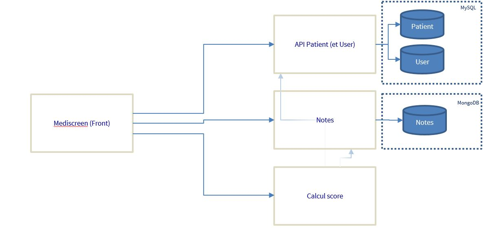

# P9-Patient
Micro-service Patient manage patients information on Mediscreen application.
this micro-service manage user informations.

## Prerequisite to run

- Java 1.8
- Spring Boot 2.2.6
- MySQL
- Docker

## Installation
### Host file

- 127.0.0.1 note
- 127.0.0.1 assessment
- 127.0.0.1 webapp
- 127.0.0.1 patient

### Docker image construction in project directory
~~~
docker build --build -t patient .
~~~
### Docker execution
if docker-compose is not use
~~~
docker run -p 8084:8084 --name P9-patient patient
~~~~
if docker-compose is user (directory patient)
~~~
docker-compose up -d
~~~~

### Database installation
- execute script create-table.sql to create tables and initiate users 

## Documentation
 http://localhost:8084/swagger-ui.html
   
## Global architecture
